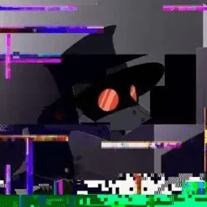

<p align="center"></p>

<h1 align="center">Hi 👋, I'm GamerXR-637</h1>
<p align="center">  </p>


###

<div align="center">
  
  
  
  
  
  
  
  
  
</div>

###

<p align="left" style="word-wrap: break-word;"> I'm just a high school student who is learning languages to use them as tools
<br>Most of the time, I am in my head, wondering and thinking many things
<br>All of that is what to write for stories, and other times is about math or thinking in general
<br>My main language is English, but I know how to speak Spanish
<br>As for me, I enjoy chess and other stuff 
<br> 
<br>I would have most of my school project here like websites for Content Creation or script for AP Computer Science 
<br>One of the main projects that I am working on is <a href="https://github.com/GamerXR-637/BetterTools-js" target="_blank" rel="noopener">BetterTools-js</a> as which the name says that its some tools for JavaScript
<br>Another language that I'm learning Lua for simple stuff.
<br>Anyways thanks for visting and reading this and luck to you on your day and life :)
<br>
<br>     - GamerXR
<br><a href="https://gamerxr637.is-a.dev/" target="_blank" rel="noopener">gamerxr637.is-a.dev</a>
</p>
  
###

<br>

```js
let data = {
  birthday: "June 25",
  id: ["Mexican", "American"],
  pronouns: ["He", "Him", "His", "Any Pronouns"],
  discord: "_gamerxr.637_",
  freeTime: ["Chess", "Video Games", "Creative Writing"],
  school: "HighSchool",
  languages: ["English", "Spanish"],
  coding_lang: ["JavaScript", "Python", "Lua", "and more"],
  things: {
    enjoy: ["Chess", "Card Games", "Math", "Space", "Short Stories"],
    books: ["Shadow Frost", "Curious Tides", "Percy Jackson"],
    quote:
      'All that we see or seem is but a dream within a dream."- Edgar Allan Poe',
    constellation: "Phenix Constellation",
    games: ["Minecraft", "Geometry Dash"],
    color: ["Red", "Green", "Blue"],
  },
  fav: {
    youtube_vid: {
      url: "https://youtu.be/RRfdgDEKeIk?si=KXdRga8dOKioYxMY",
      title: "SCP-001: All Proposals (Fully Explained)",
      by: " youtube.com/@gmdblue",
      why: "I find it interesting of the scp files and really SCP - 001",
    },
    game: {
      name: "Airborne",
      in: "Steam",
      by: ["bl4ck", "XDev"],
      why: "It really similar to gd but with a twist of Lasers",
      url: "https://store.steampowered.com/app/2338070/Airborne/",
    },
  },
  url: {
    main: "https://gamerxr637.is-a.dev/",
    "school-project": {
        chessCancer: {
            name: "Chess Cancer",
            url: "https://gamerxr637.is-a.dev/Chess-Cancer/",
        },
        technologyForOne: {
            name: "Technology for One",
            url: "https://gamerxr637.is-a.dev/Technology-for-one/",
        },
    },
  },
};
```

<h2 align="center">🌟 **My Stats!** 🌟</h2>

<div align="center">
    
</div>

<div align="center" style="display: flex; justify-content: center; gap: 20px; flex-wrap: wrap;">
    
    
</div>
